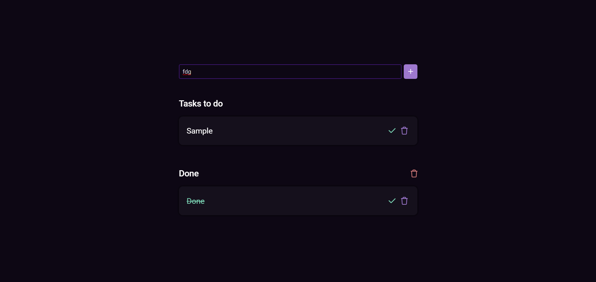

# To-Do List App

**To-Do List App** is a simple and effective task management application built with HTML, CSS, and JavaScript. Users can easily add, edit, and delete tasks, mark them as complete, and filter tasks by their status (all, active, completed). The app uses local storage to ensure tasks persist even after refreshing the page. Boost your productivity with this intuitive tool!

## Features

- **Add Task**: Quickly add new tasks to your list.
- **Mark Task as Complete**: Mark tasks as complete or incomplete.
- **Delete Task**: Remove specific tasks from your list.
- **Persistent Storage**: Tasks are saved in local storage, ensuring data persistence.
- **Filter Tasks**: View all tasks, only active tasks, or only completed tasks.
- **Clear Completed Tasks**: Remove all completed tasks at once.

## Demo



## Getting Started

Follow these instructions to get a copy of the project up and running on your local machine.

### Prerequisites

You will need a modern web browser to view and interact with the app.

### Installation

1. Clone the repository:
   ```sh
   git clone https://github.com/HannanDeveloper01/To-Do-List-App.git
   ```
